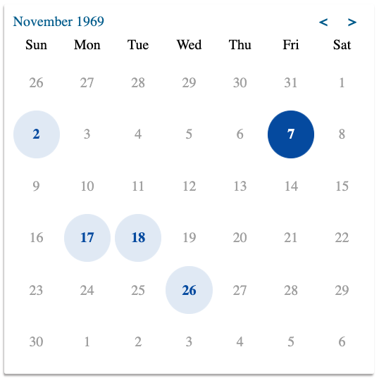

# @cxing/react-moment-calendar

!!!WORK IN PROGRESS!!!



This is a simple calendar React component that uses [moment.js](https://momentjs.com/) to handle date selection, for projects that are already using moment. It includes timezone support, returning any selected date as the beginning of the day in the selected timezone in UTC format.

```js
<Calendar
  id="foo"
  isDateDisabled={isDateDisabled}
  name="foo"
  onChange={onChange}
  required
  timezone="America/Los_Angeles"
  value={value}
/>
```

Acts as a controlled form field, taking an `id`, `name`, `value`, `required` and an `onChange` function. All of these props, except `onChange`, are applied to a `type="hidden"` input field.

- The `value` is a string in UTC format, e.g. `2020-01-01T07:00:00.000Z`.

- Your `onChange` function should set the `value` state. The method signature is:
```js
const onChange = ({id, name, value}) => {
  // update state 'value'
};
```

- The `timezone` prop is optional, and defaults to `moment.tz.guess()` (browser local). It is used to determine the beginning of the day in the selected ([IANA](https://nodatime.org/TimeZones)) timezone, and is returned in UTC format.

- Dates that are not actually part of the displayed 'month' are disabled (unselectable) by default, and only selectable when in that month's view. You can disable any other dates using the optional `isDateDisabled` prop. The method signature is:

```js
const isDateDisabled = (date, timezone) => {
  // return true to disable the date
};
```

- Any `style` or `className` props, applied to the `Calendar` component, are passed to the root container element.

## TODO

- [ ] Add tests
- [ ] Add support for `min` and `max` props
- [ ] Add support for custom styling
- [ ] Add keyboard navigation
- [ ] Add ARIA support
- [ ] Create build and npm packaging

Initially Created with [CodeSandbox](codesandbox.io)
